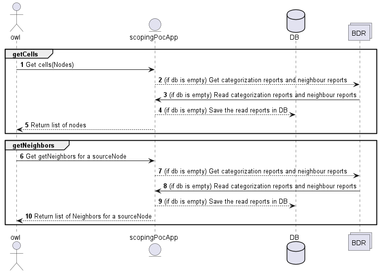

# Scoping PoC

The scoping sample rApp is used to demonstrate how reports from **cell clustering** rApp can be visualized

## Flow



## How to run in local(Windows)
1 Download docker-compose file docker-compose.yml

2 From command prompt execute the docker-compose file as below
>docker-compose up -d

3 From browser open http://localhost:8090/

4 Load reports in minio

5 Download OSS/com.ericsson.oss.apps/eric-oss-scoping-poc from gerrit

6 Open in editor/intellij

7 Compile and run the application

## How to generate Image(png) file for scopingRappFlow.puml
### Windows:
1 download plantuml jar from 
>https://plantuml.com/download

2 run below command from command prompt
> java -jar plantuml-1.2024.4.jar ./eric-oss-scoping-poc/scopingRappFlow.puml

## How to pull owl changes to repository
* use below command to pull owl/js changes to repository, change **path** if path structure is different.

```
 docker run -it --network host --rm -v //c/cell_clustering/:/cell_clustering armdocker.rnd.ericsson.se/proj-eric-oss-drop/owlws:1.7.76 sh 
 -c "npm run download -- --project \"project.schema.json\" --host \"http://localhost:8090/\" --user \"administrator\" --pass \"owl\" 
 --path \"/cell_clustering/owl/eric-oss-scoping-poc/gui/""
```

